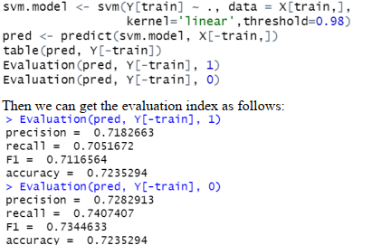
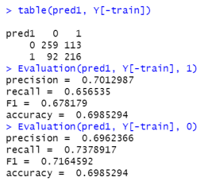

 # Sentiment-Analysis-of-Airline-Twitter-Data

## 1. Overview
In the airline industry, gaining customer insights is increasingly efficient thanks to dynamic data sources like Twitter. This report outlines the process of conducting a sentiment analysis on a dataset of 3,400 airline-related tweets, highlighting key analytical steps and methodologies using R. Each tweet was carefully pre-processed and labeled to reflect either negative or non-negative sentiments. To classify these sentiments, we applied machine learning models, specifically Support Vector Machine (SVM) and Naïve Bayes, comparing their performance to determine the most effective approach. Ultimately, we deployed the best-performing model on a fresh set of Twitter data and documented its classification precision. This analysis offers a comprehensive view of leveraging social media sentiment for actionable airline industry insights.

## 2. Steps and methods
### Data preprocessing
Load the data set and import the libraries.
Set sentiment value and combine the two datasets.
```{r}
#####Combine two dataset############
#set 1 as negative, 0 as non-negative
complaint$sentiment <- 1
noncomplaint$sentiment <- 0
tweets <- rbind(complaint, noncomplaint)
#encode with UTF-8
tweettext <- iconv(tweets$tweet,"WINDOWS-1252","UTF-8")
```
### Construct Document-Term matrix
##### a. Create corpus using tweet data

##### b. Vocabulary-based vectorization
Define preprocessing function and tokenization function using text2vec

```{r}
#deine preprocessing function and tokenization fucntion using text2vec
it_train = itoken(tweettext,preprocessor = tolower,
                  tokenizer = word_tokenizer,
                  progressbar = F)
stop_words = c("i", "me", "my", "myself", "we", "our", "ours",
               "ourselves", "you", "your", "yours")  
#build vocabulary with create_vocabulary() function
vocab = create_vocabulary(it_train, stopwords = stop_words)
# prune vocabulary
pruned_vocab = prune_vocabulary(vocab,  
                                #delete terms with frequency less than 10
                                term_count_min = 10,   
                                doc_proportion_max = 0.5,  
                                doc_proportion_min = 0.001)


```

##### c. Construct document-term matrix
```{r}
dtm.control = list(dictionary=pruned_vocab$term, tolower=T,
                   removePunctuation=T, removeNumbers=T,
                   stopwords=c(mystop,stopwords('english'), stopwords('spanish'),
                               stopwords('portuguese')),
                   stemming=T, weighting=weightTfIdf)
dtm = DocumentTermMatrix(docs, control=dtm.control)

```

##### d. Convert document term matrix to matrix and factorize the sentiment column
```{r}
#convert dtm to matrix
X <- as.matrix(dtm)
#factorize sentiment
Y <- as.numeric(tweets$sentiment)
```

##### e. Get the random sample in order to separate the dataset into training set and testing set

### Model Training and Evaluation
In this part, I train the model using SVM and NB models, and select the best performed
model by comparing the model evaluation indexes.

##### a. Define evaluation function to get precision, recall, F1 score, and accuracy
```{r}
Evaluation <- function(pred, true, class)
{

  tp <- sum( pred==class & true==class)
  fp <- sum( pred==class & true!=class)
  tn <- sum( pred!=class & true!=class)
  fn <- sum( pred!=class & true==class)
  precision <- tp/(tp+fp)
  recall <- tp/(tp+fn)
  F1 <- 2/(1/precision + 1/recall)
  accuracy <- mean(pred==true)
  cat("precision = ", precision, "\n")
  cat("recall = ", recall, "\n")
  cat("F1 = ", F1, "\n")
  cat("accuracy = ", accuracy,"\n")

}
```

##### b. Training and testing through Support Vector Machine model
```{r}
svm.model <- svm(Y[train] ~ ., data = X[train,], kernel='linear')
pred <- predict( svm.model, X[-train,] )
pred.class <- as.numeric( pred>0.98 )
table(pred.class, Y[-train])
Evaluation(pred.class, Y[-train], 1)
Evaluation(pred.class, Y[-train], 0)
```


##### c. Training and testing through Naïve Bayesion
```{r}
nb.model <- naiveBayes(X[train,], Y[train])
pred1 <- predict(nb.model, X[-train,])
table(pred1, Y[-train])
Evaluation(pred1, Y[-train], 1)
Evaluation(pred1, Y[-train], 0)
```


By comparing the performance, we choose SVM as the final model because of the higher
accuracy and F1 score.

### Predict on new data
##### a. Load data

##### b. Corpus construction and Vocabulary-based vectorization
```{r}
#construct corpus
docs.test <- Corpus(VectorSource(temp$tweet))
it_test = itoken(tweettext,preprocessor = tolower,
                  tokenizer = word_tokenizer,
                  progressbar = F)
# create vocabulary
vocab = create_vocabulary(it_test, stopwords = stop_words)
#prune vocabulary
pruned_vocab = prune_vocabulary(vocab,
                                term_count_min = 10,
                                doc_proportion_max = 0.5,
                                doc_proportion_min = 0.001)
```

##### c. Construct DTM and convert it to matrix

```{r}
# construct dtm
dtm.control = list(dictionary=pruned_vocab$term,
                   tolower=T, removePunctuation=T, removeNumbers=T,
                   stopwords=c(stopwords('english'), stopwords('spanish'),
                               stopwords('portuguese')),
                   stemming=T, weighting=weightTfIdf)
dtm.test <- DocumentTermMatrix(docs.test, dtm.control)
# convert dtm to matrix
dtm.test.matrix <- as.matrix(dtm.test)
```
##### d. Get classification using SVM
```{r}
#prediction using SVM (because of the higher accuracy)
pred <- predict( svm.model, dtm.test.matrix )
pred.class <- as.numeric( pred>0.99 )
#pred.test <- predict(svm.model, dtm.test.matrix)
temp$sentiment = pred.class
nrow(temp[temp$sentiment==1,])
```

## 3. classification precision
After getting the output file, I evaluate whether the sentiment is correct and output my
evaluation result in the second column. 1 denotes the sentiment is correctly classified, and 0 is
the opposite.

In the end, the precision of my classification is about 66.87% (222/332)
